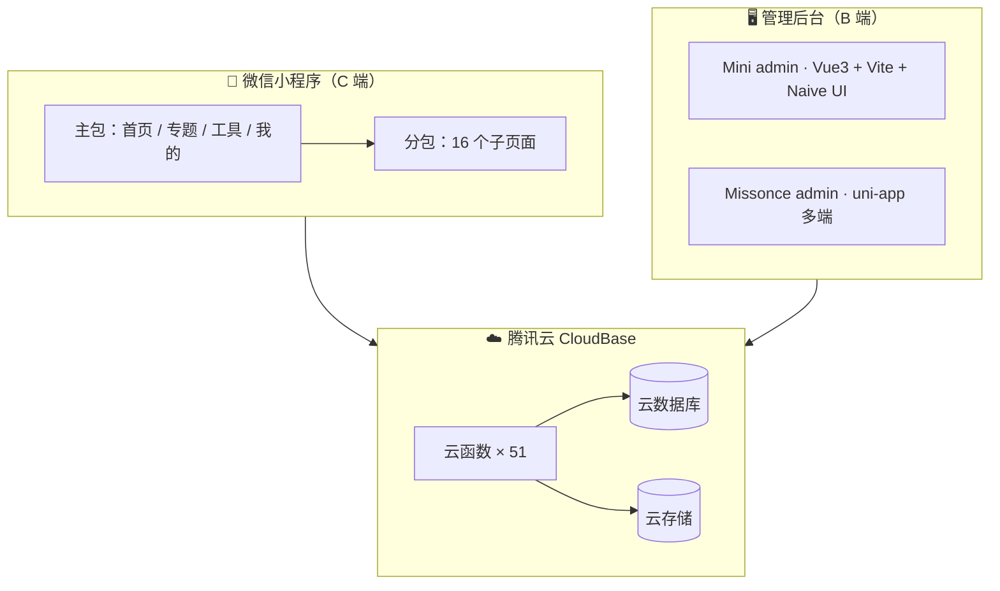

# 🌶️ 小辣椒动态头像壁纸

> 一个基于 **微信小程序 + 腾讯云开发 (CloudBase)** 的全栈内容社区应用 —— 动态头像 DIY、海量壁纸头像、灵感文案、积分会员与微信小店，配套可视化管理后台。


---

## 📖 项目简介

「小辣椒动态头像壁纸」是面向 C 端用户的内容社区型小程序：用户可以浏览海量壁纸与头像、在线 DIY 专属动态头像、用 AI 生成灵感文案并分享海报，同时通过积分会员与激励广告体系形成完整的商业化闭环。项目配套一套 Web 可视化管理后台，实现资源、首页、专题、广告、用户与运营数据的全链路管理。

## ✨ 项目亮点

- 🎨 **动态头像 DIY** —— 静态 / GIF 底图 + 装饰层 + 头像框 + 滤镜，云函数实时合成专属动态 GIF 头像
- 🖼️ **海量内容流** —— 壁纸瀑布流 + 头像网格，动态首页由后台可视化装修驱动
- ✍️ **灵感文案** —— 接入通义千问（qwen）生成语录 / 海报文案，一键生成带小程序码的分享海报
- 💰 **商业化闭环** —— 激励广告 + 积分会员体系 + 微信小店跳转 + 社群公告运营
- 🖥️ **可视化后台** —— Vue3 + Naive UI + ECharts，资源 / 首页 / 专题 / 广告 / 用户 / 数据看板一应俱全
- ⚡ **性能优先** —— 图片自动转 WebP + 自适应缩放、首屏数据并行加载、骨架屏、多级缓存与定时预构建

## 📱 功能特性

### 小程序端（C 端）

| 模块 | 说明 |
| --- | --- |
| 动态首页 | 轮播图 + 推荐板块，布局由后台 `home_sections` 驱动，支持预构建缓存直读 |
| 专题 | 后台可视化拖拽装修的专题页，支持自动筛选模式 |
| 壁纸专区 | 瀑布流展示，支持分类 / 最新 / 最热排序 |
| 头像专区 | 网格布局，支持分类筛选 |
| 工具区 | 头像 DIY、灵感文案等创作工具入口 |
| 头像 DIY | 动态头像在线合成（云函数 sharp + gifencoder） |
| 灵感文案 | AI 生成语录 / 文案 + 海报分享（含小程序码） |
| 积分 / 会员 | 签到、邀请、看广告奖励、下载次数、会员兑换 |
| 收藏 / 历史 | 登录后可收藏资源、查看下载记录 |
| 微信小店 | 内嵌跳转微信小店，承接流量变现 |
| 社群运营 | 群公告详情、群二维码、web-view 落地页 |

### 管理后台（B 端）

- **资源管理** —— 壁纸 / 头像上传、编辑、批量删除，AI 自动识别分类与标签
- **首页装修** —— 可视化配置首页板块、Tab、轮播图
- **专题装修** —— 拖拽式专题布局设计，支持历史版本回滚
- **运营看板** —— 用户 / 资源 / 事件统计、趋势、Top 分类
- **广告配置** —— 广告位管理、小程序页面绑定
- **用户管理** —— 终端用户搜索、会员等级调整、广告次数重置
- **内容运营** —— 公告管理、联系方式（公众号二维码）配置

## 🏗️ 技术架构



| 层 | 技术栈 |
| --- | --- |
| 小程序端 | 微信小程序原生（WXML / WXSS / JS / JSON），分包 + 懒加载 |
| 后端 | 腾讯云开发 CloudBase：云函数（Node.js）+ 云数据库 + 云存储 |
| 管理后台 A | Vue3 + Vite6 + TypeScript + Tailwind CSS + Naive UI + Pinia + ECharts |
| 管理后台 B | uni-app（Vue3）多端后台，可编译 App / Web / 小程序 |
| AI 能力 | 阿里通义千问 `qwen-vl-plus`（识图）/ `qwen-turbo`（文案） |
| 图片处理 | sharp + gifencoder（动态头像合成） |

## 📂 目录结构

```
小辣椒头像/
├── WeChat Mini/          # 微信小程序（C 端）+ 云函数
│   ├── pages/            # 主包页面（首页 / 专题 / 工具 / 我的）
│   ├── subpackages/      # 分包页面（16 个）
│   ├── components/       # 公共组件（瀑布流 / 海报分享）
│   ├── utils/            # api / auth / image / logger
│   └── cloudfunctions/   # 51 个云函数
├── Mini admin/           # Web 管理后台（Vue3 + Vite + TS + Tailwind）
├── Missonce admin/       # 多端管理后台（uni-app）
└── 设计方案/             # HTML 原型 + 产品 / 技术文档
```

## 🚀 快速开始

### 1. 小程序端

1. 使用「微信开发者工具」打开 `WeChat Mini/` 目录
2. 在 `project.config.json` 填入自己的 `appid`，并在云开发配置中绑定 CloudBase 环境
3. 为 `cloudfunctions/` 下各云函数安装依赖并逐一上传部署
4. 首次部署时执行 `initDatabase` 云函数初始化数据库集合与积分配置

### 2. Web 管理后台

```bash
cd "Mini admin"
npm install
npm run dev        # 本地开发
npm run build      # 生产构建
npm run deploy     # 部署到 CloudBase Hosting
```

## ☁️ 云函数概览（共 51 个）

| 类别 | 代表函数 |
| --- | --- |
| 后台管理 | `adminAuth`、`adminSession`、`adConfigManager`、`manageTopics`、`manageHomeTabs` … |
| 资源管理 | `uploadResource`、`updateResource`、`batchDeleteResources`、`analyzeResource` … |
| AI / 生成 | `generateDynamicAvatar`、`generatePosterQuotes`、`aiGenerateText` |
| 读取 / 查询 | `getResources`、`getDailyPicks`、`getHomeTabs`、`getTopics`、`getConfig` … |
| 用户 / 互动 | `login`、`toggleInteraction`、`userPoints`、`updateUserInfo` |
| 日志 / 埋点 | `logEvent`、`logError` |
| 工具 / 运维 | `proxyDownload`、`shareCode`、`getQRCode`、`initDatabase`、`updateDatabaseIndexes` |
| 定时触发 | `prebuildHomeFeed`、`prebuildTopics`、`resetDailyHotScore` |

> 完整清单与依赖集合说明见 [`WeChat Mini/README.md`](./WeChat%20Mini/README.md)

## 📄 文档与设计资产

`设计方案/` 目录包含产品审查报告、首页小红书风格改版方案、全站样式方案、团队技术提升方案，以及多套 HTML 高保真原型。

## 🧭 相关项目

- **去水印小程序** —— 同属开发者 Missonce 系列，小程序内可直接跳转引流

## 📜 许可证

本项目仅供学习与交流使用，未经许可请勿用于商业用途。
